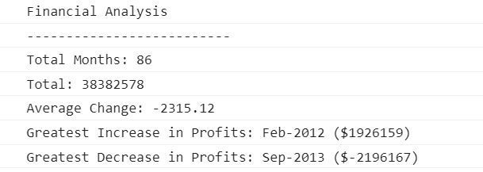

# Unit 4 Challenge: Console Finances

## Overview

In this challenge, i had to solve a real-world situation in which my newfound JavaScript skills come in handy (console log, variables, primitive types, logical and comparison operators, conditional statements, arrays, iteration, prompts, switch-case, and conditional loops). I created the code for analyzing the financial records of a company. The financial dataset was already provided in the index.js starter file.

## Instructions

1. Create a new GitHub repo called `Console-Finances`. Then, clone it to your computer.

2. Copy the starter files in your local git repository.
   
You have been given a dataset composed of arrays with two fields, Date and Profit/Losses.

Your task is to write JavaScript code that analyzes the records to calculate each of the following:

* The total number of months included in the dataset.

* The net total amount of Profit/Losses over the entire period.

* The average of the **changes** in Profit/Losses over the entire period.
  * You will need to track what the total change in profits are from month to month and then find the average.
  * (`Total/Number of months`)

* The greatest increase in profits (date and amount) over the entire period.

* The greatest decrease in losses (date and amount) over the entire period.

When you open your code in the browser your resulting analysis should look similar to the following:

Your final code should print the analysis to the console.

## Review

You are required to submit BOTH of the following for review:

* The URL of the deployed application is [here](https://inaciobanu.github.io/Console-Finances/)

* The URL of the GitHub repository that contains your code is [here](https://github.com/inaciobanu/Console-Finances).
---

[def]: Sample_screenshot.png